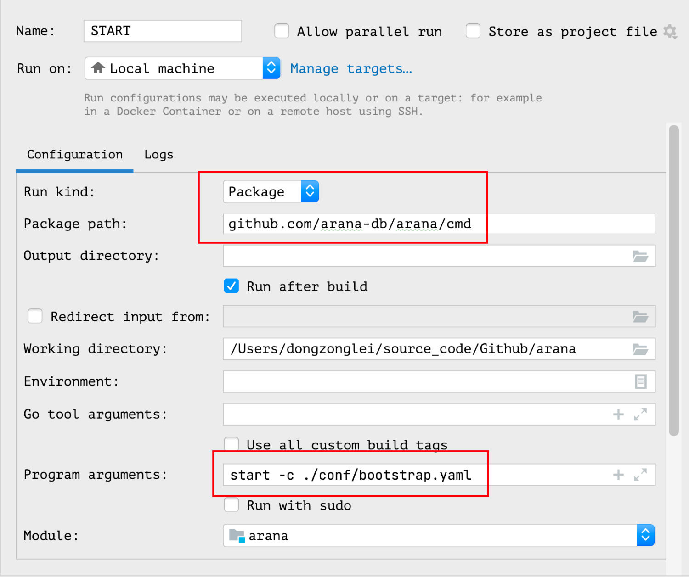

# Getting Started

## Source Compile Started

- 从 Github 克隆 [arana]((https://github.com/arana-db/arana)) 源码；

```shell
git clone https://github.com/arana-db/arana.git
```

- 切换到源码根目录路径，执行 `make build` 命令，编译生成二进制可执行文件，编译后生成的二进制可执行文件在 `dist` 目录下，默认文件名称为 `arana`；

```shell
make build
```

- 通过执行二进制可执行文件，启动 `arana` 服务；

```shell
./arana start -c {bootstrap_config_path}

# 示例
./arana start -c bootstrap.yaml
```

## Docker Started

## Source Code Debug

- 首先确保本地 `MySQL` 服务正常运行，配置 `host`: `127.0.0.1 arana-mysql`；
- 使用 `arana/scripts/sharding.sql` 初始化 `employee` 测试数据库；
- 编辑 `arana/conf/config.yaml` 配置文件，修改 `username`、`password`、`port` 等信息与本地 `MySQL` 一致；
- 配置 `IDE` 调试环境，信息如下：
```shell
Program arguments：start -c ./conf/bootstrap.yaml
```

- 通过 `IDE` `debug` 模式启动服务，`mycli` 连接 `arana` 服务；
- `mycli` 发送命令到 `arana`，通过 `IDE debug` 工具调试源代码；
```shell
mycli -h127.0.0.1 -P13306 -udksl employees -p123456
```
